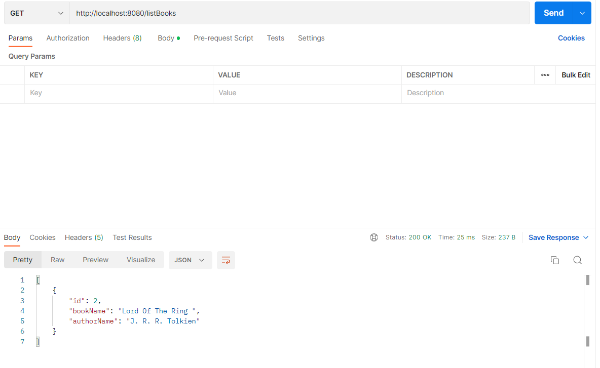
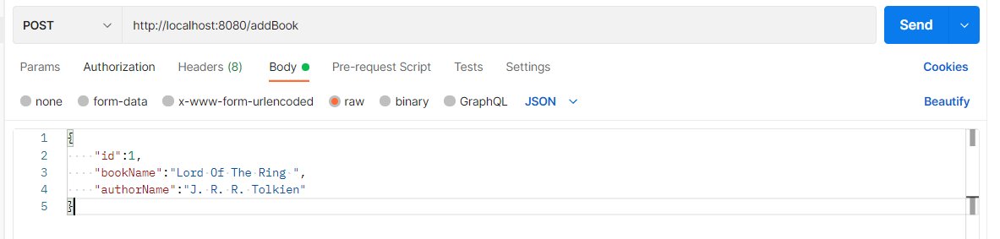
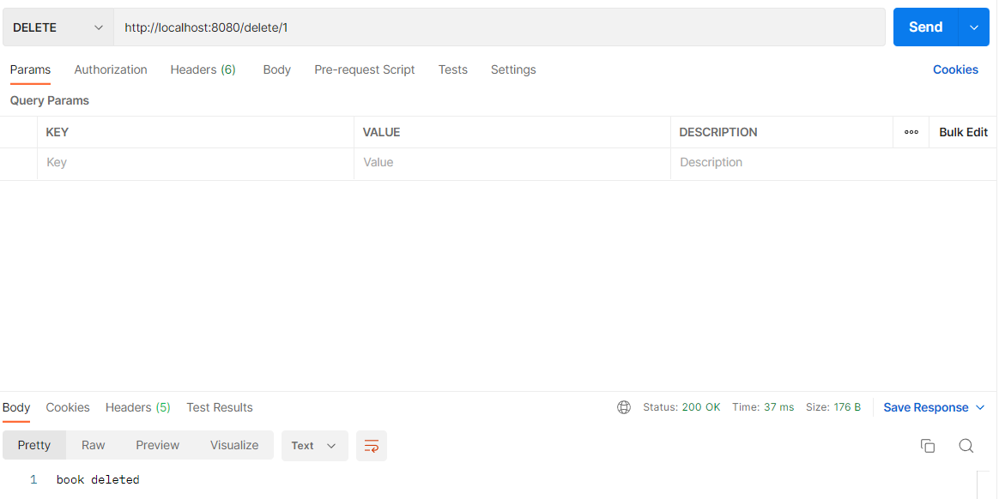
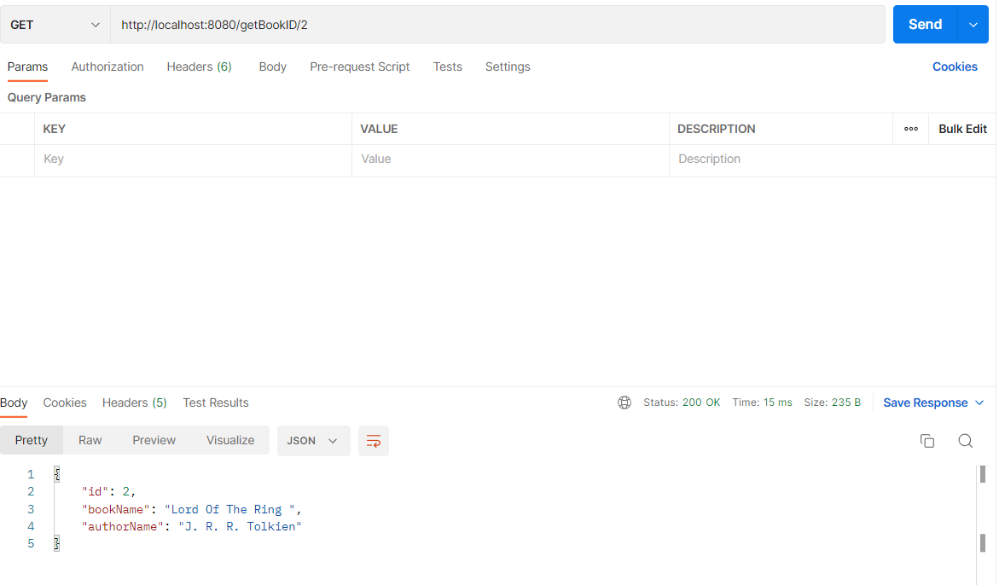

<!--  -->

<p align="center">
  
</p>
<p align="center" ><b>This project was made for Spring Boot and MongoDB with Docker</b></p> 
 

<p align="center">
  <a href="https://github.com/Mehmetulas98/SpringBootAPI">
    
  </a>
  
   
</p>
<p align="center">
  <a href="#project">Project</a> •
  <a href="#how-to-use">How To Use</a> •
  <a href="#credits">Credits</a> •
  <a href="#license">License</a>
</p>


# Project


Mongo Express can be reached from <a href="localhost:8081">localhost:8081</a>

## List all of books (GET)

 

## Add book (POST)

 

## Delete book (DELETE)

 

## Query with ID (GET)

 

# How To Use

To clone and run this application, you'll need [Docker](https://www.docker.com/), [Java 18](https://www.oracle.com/java/technologies/javase/jdk18-archive-downloads.html) and [Maven](https://maven.apache.org/download.cgi) installed on your computer. From your command line:

```bash
# Clone this repository
$ git clone https://github.com/Mehmetulas98/SpringBootAPI

# Go into the repository
$ cd demo

# Create snapshot file under targe folder in Java project for Dockerfile
$ mvn clean package

# Build docker image with Dockerfile
$ docker build -t springboot-mongodb:1.0 .

# Run the app wih docker compose file
$ docker-compose -f docker-compose.yaml up 

# Add database and table
$ For use API add "BookStores" database and "Book" table inside of this database. 
```

# Credits

This software uses the following technologies:

- [Java 18](https://www.oracle.com/java/technologies/javase/jdk18-archive-downloads.html)
- [Maven](https://maven.apache.org/download.cgi)
- [Docker](https://www.docker.com/)
- [Mongo](https://www.mongodb.com/)
- [MongoExpress](https://github.com/mongo-express/mongo-express)
- [Spring Boot](https://spring.io/projects/spring-boot/)

# License

MIT
